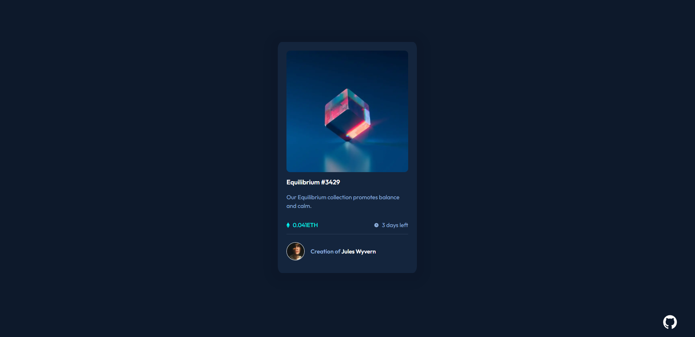

Hello!
This is my second project from Frontend Mentor.

The challenge of the project is https://www.frontendmentor.io/challenges/nft-preview-card-component-SbdUL_w0U

Estamos haciendo el README. Quiero poner un screenshot de la página

# Screenshot of the solution

### Built with

-  HTML with Handlebars
-  CSS custom properties
-  Flexbox
-  CSS Grid
-  [Webpack Init](https://github.com/Renato6GS/webpack-init) - My webpack init

### What I learned

My goal with this practice was to reinforce my knowledge of HTML and CSS with responsive design. Also, this is my first time using my "webpack init" as well as keeping a more orderly sequence of commits, thanks to the Midudev book.

I leave the link to his book, if you like to buy it:
[Aprendiendo Git](https://leanpub.com/aprendiendo-git)

### Useful resources

-  [CSS filter generator to convert from black to target hex color](https://codepen.io/sosuke/pen/Pjoqqp) - This helped me for change color to my SVG

## Author

-  Frontend Mentor - [@Renato6GS](https://www.frontendmentor.io/profile/Renato6GS)
